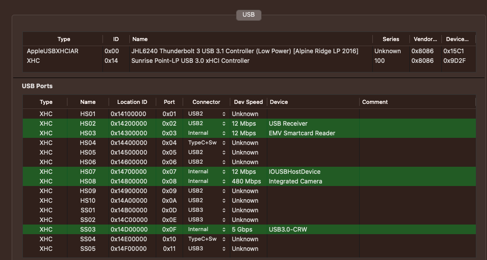
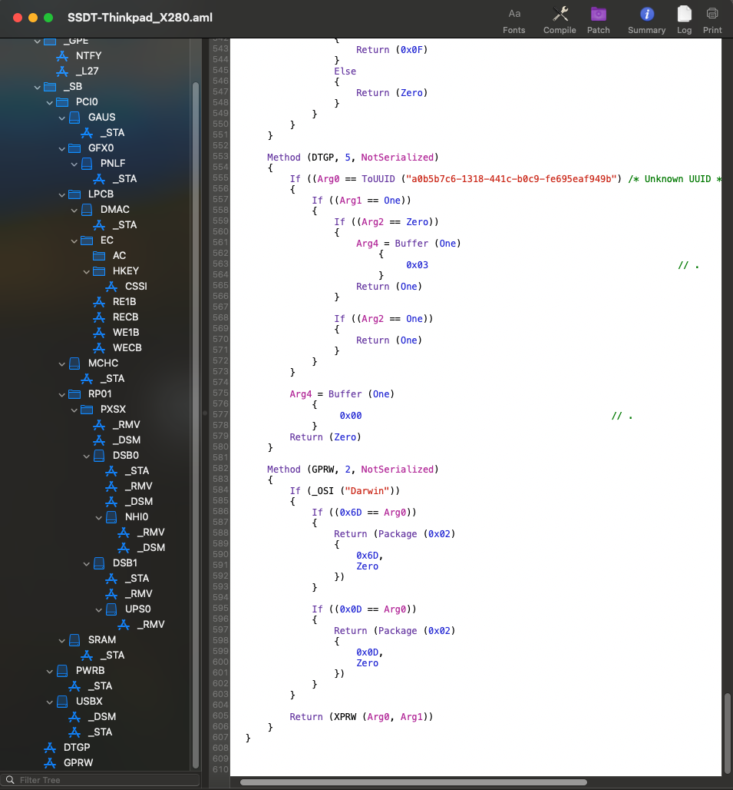
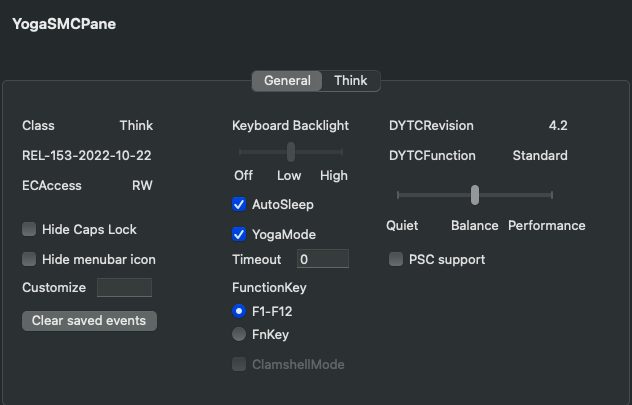

[](https://gitter.im/ICE-LAKE-HACKINTOSH-DEVELOPMENT/community)
[](https://github.com/Baio1977/EFI-Varie-Hackintosh)
[](https://t.me/HackintoshLife_it)
[](https://www.facebook.com/hackintoshlife/)
[](https://www.instagram.com/hackintoshlife.it_official/)

# Lenovo ThinkPad X280 20KE Hackintosh 


 
## Specification:

- CPU: Intel Core i5-8250u (KabyLake -r) @ 1.60GHz
- Memory: 1x 8GB DDR4 2666Mhz
- Harddrive: 1x 256 PCIe NVMe
- Display: 12" non-touch 1920x1080 IPS, anti-glare 
- GPU: Intel UHD 620
- Camera: 1x IR Camera & RGB 720p HD Camera & Mic with Thinkpad Privacy Shutter
- WLAN: Intel Wi-Fi 8265\8270 (Soldered on)
- Battery: Integrate Li-Polymer 50Wh internal battery - Up to 16.5 hours*
- Touchpad: Synaptics 
- Audio: Realtek HDA ALC257 (aka ALC3287)
- 2 x USB 3.2 Gen 1** (one Always On)
- 1 x USB 3.2 Gen 1 Type-C (Power Delivery, DisplayPort, Data transfer)
- 1 x USB 3.2 Gen 2 Type-C / Intel Thunderbolt 3 (Power Delivery, DisplayPort, Data transfer)
- MicroSD card reader (USB)
- Headphone / mic combo
- Micro-SIM slot
- HDMI 1.4b
- RJ45 Gigabit Ethernet I219-LM
 

## BIOS Settings:

Bios: 1.49

- Under Config Tap

    Display

       Boot Display Device -> Thinkpad LCD

       Shared Display Priority -> USB Type-C

       Total Garphics Memory ->256MB

       Boot Time Extension -> Disabled

- Under Security Tap

    Memory Protection -> Execution Prevention -> On

    Secure Boot -> Secure Boot -> Off

                         -> Platform Mode -> UserMode

                         ->Secure Boot Mode -> Standard Mode

- Under Startup Tap

    UEFI/Legacy Boot ->UEFI Only

       CSM Support -> No 
	   
- Under Thunderbolt menu

    Thunderbolt BIOS Assist Mode`-> UEFI Only
   
    Wake by Thunderbolt(TM) -> No
   
    Security Level`-> No
   
    Support in Pre Boot Environment > Thunderbolt(TM) device`-> No
   
## Working:

 - Keyboard (including all Fn keys)
 - Trackpad with gestures / Trackstick
 - Battery indicator
 - Display auto brightness
 - Audio (Internal and headphone jack)
 - Microphone
 - Ethernet
 - GPU acceleration
 - Camera
 - Intel Wireless / Bluetooth (soldered in so can't be replaced)
 - Sleep / Wake
 - Native CPU power management
 - MicroSD card reader
 - HDMI video and audio 
 - USB-C to HDMI Video and audio works
 - USB-C to USB-C Video but no audio
 - Thunderbolt JHL6240 Alpine Ridge Work whit HotPlug
 
 
## Not Tested:

## USB Map:



## Video Output:


## Trackpad setup:


## SSDT Full Hack




TB3 Patch ACPI

```
    Scope (\)
    {
        Scope (_SB)
        {
            Scope (PCI0)
            {
                If (_OSI ("Darwin"))
                {
                    Scope (RP01)
                    {
                        Scope (PXSX)
                        {
                            Name (_STA, Zero)  // _STA: Status
                        }

                        Scope (HRUS)
                        {
                            Name (_STA, Zero)  // _STA: Status
                        }

                        Method (_RMV, 0, NotSerialized)  // _RMV: Removal Status
                        {
                            Return (Zero)
                        }

                        Device (UPSB)
                        {
                            Name (_ADR, Zero)  // _ADR: Address
                            OperationRegion (A1E0, PCI_Config, Zero, 0x40)
                            Field (A1E0, ByteAcc, NoLock, Preserve)
                            {
                                AVND,   32, 
                                BMIE,   3, 
                                Offset (0x18), 
                                PRIB,   8, 
                                SECB,   8, 
                                SUBB,   8, 
                                Offset (0x1E), 
                                    ,   13, 
                                MABT,   1
                            }

                            Method (_BBN, 0, NotSerialized)  // _BBN: BIOS Bus Number
                            {
                                Return (SECB) /* \_SB_.PCI0.RP01.UPSB.SECB */
                            }

                            Method (_STA, 0, NotSerialized)  // _STA: Status
                            {
                                Return (0x0F)
                            }

                            Method (_RMV, 0, NotSerialized)  // _RMV: Removal Status
                            {
                                Return (Zero)
                            }

                            Method (_DSM, 4, NotSerialized)  // _DSM: Device-Specific Method
                            {
                                If ((Arg0 == ToUUID ("a0b5b7c6-1318-441c-b0c9-fe695eaf949b") /* Unknown UUID */))
                                {
                                    Local0 = Package (0x0A)
                                        {
                                            "AAPL,slot-name", 
                                            Buffer (0x0C)
                                            {
                                                "Thunderbolt"
                                            }, 

                                            "built-in", 
                                            Buffer (One)
                                            {
                                                 0x00                                             // .
                                            }, 

                                            "model", 
                                            Buffer (0x45)
                                            {
                                                "JHL6240 Thunderbolt 3 UPSB Bridge (Low Power) [Alpine Ridge LP 2016]"
                                            }, 

                                            "device_type", 
                                            Buffer (0x0B)
                                            {
                                                "PCI bridge"
                                            }, 

                                            "PCI-Thunderbolt", 
                                            One
                                        }
                                    DTGP (Arg0, Arg1, Arg2, Arg3, RefOf (Local0))
                                    Return (Local0)
                                }

                                Return (Zero)
                            }

                            Device (DSB0)
                            {
                                Name (_ADR, Zero)  // _ADR: Address
                                OperationRegion (A1E0, PCI_Config, Zero, 0x40)
                                Field (A1E0, ByteAcc, NoLock, Preserve)
                                {
                                    AVND,   32, 
                                    BMIE,   3, 
                                    Offset (0x18), 
                                    PRIB,   8, 
                                    SECB,   8, 
                                    SUBB,   8, 
                                    Offset (0x1E), 
                                        ,   13, 
                                    MABT,   1
                                }

                                Method (_STA, 0, NotSerialized)  // _STA: Status
                                {
                                    Return (0x0F)
                                }

                                Method (_RMV, 0, NotSerialized)  // _RMV: Removal Status
                                {
                                    Return (Zero)
                                }

                                Method (_BBN, 0, NotSerialized)  // _BBN: BIOS Bus Number
                                {
                                    Return (SECB) /* \_SB_.PCI0.RP01.UPSB.DSB0.SECB */
                                }

                                Method (_DSM, 4, NotSerialized)  // _DSM: Device-Specific Method
                                {
                                    If ((Arg0 == ToUUID ("a0b5b7c6-1318-441c-b0c9-fe695eaf949b") /* Unknown UUID */))
                                    {
                                        Local0 = Package (0x0A)
                                            {
                                                "AAPL,slot-name", 
                                                Buffer (0x0C)
                                                {
                                                    "Thunderbolt"
                                                }, 

                                                "built-in", 
                                                Buffer (One)
                                                {
                                                     0x00                                             // .
                                                }, 

                                                "model", 
                                                Buffer (0x45)
                                                {
                                                    "JHL6240 Thunderbolt 3 DSB0 Bridge (Low Power) [Alpine Ridge LP 2016]"
                                                }, 

                                                "device_type", 
                                                Buffer (0x0B)
                                                {
                                                    "PCI bridge"
                                                }, 

                                                "PCIHotplugCapable", 
                                                Zero
                                            }
                                        DTGP (Arg0, Arg1, Arg2, Arg3, RefOf (Local0))
                                        Return (Local0)
                                    }

                                    Return (Zero)
                                }

                                Device (NHI0)
                                {
                                    Name (_ADR, Zero)  // _ADR: Address
                                    Name (_STR, Unicode ("Thunderbolt"))  // _STR: Description String
                                    Method (_STA, 0, NotSerialized)  // _STA: Status
                                    {
                                        Return (0x0F)
                                    }

                                    Method (_RMV, 0, NotSerialized)  // _RMV: Removal Status
                                    {
                                        Return (Zero)
                                    }

                                    Method (_DSM, 4, NotSerialized)  // _DSM: Device-Specific Method
                                    {
                                        Local0 = Package (0x1B)
                                            {
                                                "AAPL,slot-name", 
                                                Buffer (0x0C)
                                                {
                                                    "Thunderbolt"
                                                }, 

                                                "name", 
                                                Buffer (0x24)
                                                {
                                                    "Alpine Ridge Thunderbolt Controller"
                                                }, 

                                                "model", 
                                                Buffer (0x3E)
                                                {
                                                    "JHL6240 Thunderbolt 3 NHI0 (Low Power) [Alpine Ridge LP 2016]"
                                                }, 

                                                "device_type", 
                                                Buffer (0x12)
                                                {
                                                    "System peripheral"
                                                }, 

                                                "ThunderboltDROM", 
                                                Buffer (0x65)
                                                {
                                                    /* 0000 */  0x63, 0x00, 0x06, 0xBB, 0xAD, 0xA2, 0x93, 0x78,  // c......x
                                                    /* 0008 */  0x2D, 0xF4, 0x15, 0x15, 0x66, 0x01, 0x58, 0x00,  // -...f.X.
                                                    /* 0010 */  0x01, 0x00, 0x10, 0x00, 0x01, 0x00, 0x08, 0x81,  // ........
                                                    /* 0018 */  0x80, 0x02, 0x80, 0x00, 0x00, 0x00, 0x08, 0x82,  // ........
                                                    /* 0020 */  0x90, 0x01, 0x80, 0x00, 0x00, 0x00, 0x08, 0x83,  // ........
                                                    /* 0028 */  0x80, 0x04, 0x80, 0x01, 0x00, 0x00, 0x08, 0x84,  // ........
                                                    /* 0030 */  0x90, 0x03, 0x80, 0x01, 0x00, 0x00, 0x05, 0x85,  // ........
                                                    /* 0038 */  0x09, 0x01, 0x00, 0x05, 0x86, 0x09, 0x01, 0x00,  // ........
                                                    /* 0040 */  0x02, 0x87, 0x03, 0x88, 0x20, 0x03, 0x89, 0x80,  // .... ...
                                                    /* 0048 */  0x02, 0xCA, 0x02, 0xCB, 0x12, 0x01, 0x4C, 0x65,  // ......Le
                                                    /* 0050 */  0x6E, 0x6F, 0x76, 0x6F, 0x20, 0x54, 0x68, 0x69,  // novo Thi
                                                    /* 0058 */  0x6E, 0x6B, 0x70, 0x61, 0x64, 0x00, 0x07, 0x02,  // nkpad...
                                                    /* 0060 */  0x58, 0x32, 0x38, 0x30, 0x00                     // X280.
                                                }, 

                                                "ThunderboltConfig", 
                                                Buffer (0x20)
                                                {
                                                    /* 0000 */  0x00, 0x02, 0x1C, 0x00, 0x02, 0x00, 0x05, 0x03,  // ........
                                                    /* 0008 */  0x01, 0x00, 0x04, 0x00, 0x05, 0x03, 0x02, 0x00,  // ........
                                                    /* 0010 */  0x03, 0x00, 0x05, 0x03, 0x01, 0x00, 0x00, 0x00,  // ........
                                                    /* 0018 */  0x03, 0x03, 0x02, 0x00, 0x01, 0x00, 0x02, 0x00   // ........
                                                }, 

                                                "pathcr", 
                                                Buffer (0x50)
                                                {
                                                    /* 0000 */  0x04, 0x00, 0x00, 0x00, 0x00, 0x00, 0x00, 0x00,  // ........
                                                    /* 0008 */  0x00, 0x00, 0x07, 0x00, 0x10, 0x00, 0x10, 0x00,  // ........
                                                    /* 0010 */  0x05, 0x00, 0x00, 0x00, 0x00, 0x00, 0x00, 0x00,  // ........
                                                    /* 0018 */  0x00, 0x00, 0x07, 0x00, 0x10, 0x00, 0x10, 0x00,  // ........
                                                    /* 0020 */  0x01, 0x00, 0x00, 0x00, 0x0B, 0x00, 0x0E, 0x00,  // ........
                                                    /* 0028 */  0x0E, 0x00, 0x00, 0x00, 0x00, 0x00, 0x00, 0x00,  // ........
                                                    /* 0030 */  0x02, 0x00, 0x00, 0x00, 0x00, 0x00, 0x00, 0x00,  // ........
                                                    /* 0038 */  0x00, 0x00, 0x04, 0x00, 0x02, 0x00, 0x01, 0x00,  // ........
                                                    /* 0040 */  0x03, 0x00, 0x00, 0x00, 0x00, 0x00, 0x00, 0x00,  // ........
                                                    /* 0048 */  0x00, 0x00, 0x07, 0x00, 0x02, 0x00, 0x01, 0x00   // ........
                                                }, 

                                                "linkDetails", 
                                                Buffer (0x08)
                                                {
                                                     0x08, 0x00, 0x00, 0x00, 0x03, 0x00, 0x00, 0x00   // ........
                                                }, 

                                                "TBTFlags", 
                                                Buffer (0x04)
                                                {
                                                     0x03, 0x00, 0x00, 0x00                           // ....
                                                }, 

                                                "sscOffset", 
                                                Buffer (0x02)
                                                {
                                                     0x00, 0x07                                       // ..
                                                }, 

                                                "TBTDPLowToHigh", 
                                                Buffer (0x04)
                                                {
                                                     0x01, 0x00, 0x00, 0x00                           // ....
                                                }, 

                                                "ThunderboltUUID", 
                                                ToUUID ("95e6bcfa-5a4a-5f81-b3d2-f0e4bd35cf1e") /* Unknown UUID */, 
                                                "power-save", 
                                                One, 
                                                Buffer (One)
                                                {
                                                     0x00                                             // .
                                                }
                                            }
                                        DTGP (Arg0, Arg1, Arg2, Arg3, RefOf (Local0))
                                        Return (Local0)
                                    }
                                }
                            }

                            Device (DSB1)
                            {
                                Name (_ADR, 0x00010000)  // _ADR: Address
                                Name (_SUN, One)  // _SUN: Slot User Number
                                OperationRegion (A1E0, PCI_Config, Zero, 0x40)
                                Field (A1E0, ByteAcc, NoLock, Preserve)
                                {
                                    AVND,   32, 
                                    BMIE,   3, 
                                    Offset (0x18), 
                                    PRIB,   8, 
                                    SECB,   8, 
                                    SUBB,   8, 
                                    Offset (0x1E), 
                                        ,   13, 
                                    MABT,   1
                                }

                                OperationRegion (A1E1, PCI_Config, 0xC0, 0x40)
                                Field (A1E1, ByteAcc, NoLock, Preserve)
                                {
                                    Offset (0x01), 
                                    Offset (0x02), 
                                    Offset (0x04), 
                                    Offset (0x08), 
                                    Offset (0x0A), 
                                        ,   5, 
                                    TPEN,   1, 
                                    Offset (0x0C), 
                                    SSPD,   4, 
                                        ,   16, 
                                    LACR,   1, 
                                    Offset (0x10), 
                                        ,   4, 
                                    LDIS,   1, 
                                    LRTN,   1, 
                                    Offset (0x12), 
                                    CSPD,   4, 
                                    CWDT,   6, 
                                        ,   1, 
                                    LTRN,   1, 
                                        ,   1, 
                                    LACT,   1, 
                                    Offset (0x14), 
                                    Offset (0x30), 
                                    TSPD,   4
                                }

                                OperationRegion (A1E2, PCI_Config, 0x80, 0x08)
                                Field (A1E2, ByteAcc, NoLock, Preserve)
                                {
                                    Offset (0x01), 
                                    Offset (0x02), 
                                    Offset (0x04), 
                                    PSTA,   2
                                }

                                Method (_BBN, 0, NotSerialized)  // _BBN: BIOS Bus Number
                                {
                                    Return (SECB) /* \_SB_.PCI0.RP01.UPSB.DSB1.SECB */
                                }

                                Method (_STA, 0, NotSerialized)  // _STA: Status
                                {
                                    Return (0x0F)
                                }

                                Method (_RMV, 0, NotSerialized)  // _RMV: Removal Status
                                {
                                    Return (Zero)
                                }

                                Device (UPS0)
                                {
                                    Name (_ADR, Zero)  // _ADR: Address
                                    OperationRegion (ARE0, PCI_Config, Zero, 0x04)
                                    Field (ARE0, ByteAcc, NoLock, Preserve)
                                    {
                                        AVND,   16
                                    }

                                    Method (_RMV, 0, NotSerialized)  // _RMV: Removal Status
                                    {
                                        Return (One)
                                    }
                                }
                            }

                            Device (DSB2)
                            {
                                Name (_ADR, 0x00020000)  // _ADR: Address
                                OperationRegion (A1E0, PCI_Config, Zero, 0x40)
                                Field (A1E0, ByteAcc, NoLock, Preserve)
                                {
                                    AVND,   32, 
                                    BMIE,   3, 
                                    Offset (0x18), 
                                    PRIB,   8, 
                                    SECB,   8, 
                                    SUBB,   8, 
                                    Offset (0x1E), 
                                        ,   13, 
                                    MABT,   1
                                }

                                Method (_BBN, 0, NotSerialized)  // _BBN: BIOS Bus Number
                                {
                                    Return (SECB) /* \_SB_.PCI0.RP01.UPSB.DSB2.SECB */
                                }

                                Method (_STA, 0, NotSerialized)  // _STA: Status
                                {
                                    Return (0x0F)
                                }

                                Method (_RMV, 0, NotSerialized)  // _RMV: Removal Status
                                {
                                    Return (Zero)
                                }

                                Method (_DSM, 4, NotSerialized)  // _DSM: Device-Specific Method
                                {
                                    If ((Arg0 == ToUUID ("a0b5b7c6-1318-441c-b0c9-fe695eaf949b") /* Unknown UUID */))
                                    {
                                        Local0 = Package (0x02)
                                            {
                                                "PCIHotplugCapable", 
                                                Zero
                                            }
                                        DTGP (Arg0, Arg1, Arg2, Arg3, RefOf (Local0))
                                        Return (Local0)
                                    }

                                    Return (Zero)
                                }

                                Device (XHC2)
                                {
                                    Name (_ADR, Zero)  // _ADR: Address
                                    Method (_STA, 0, NotSerialized)  // _STA: Status
                                    {
                                        Return (0x0F)
                                    }

                                    Method (_RMV, 0, NotSerialized)  // _RMV: Removal Status
                                    {
                                        Return (Zero)
                                    }

                                    Method (_PRW, 0, NotSerialized)  // _PRW: Power Resources for Wake
                                    {
                                        Return (Package (0x02)
                                        {
                                            0x69, 
                                            0x03
                                        })
                                    }

                                    Method (_DSM, 4, NotSerialized)  // _DSM: Device-Specific Method
                                    {
                                        Local0 = Package (0x10)
                                            {
                                                "AAPL,slot-name", 
                                                Buffer (0x11)
                                                {
                                                    "Thunderbolt-XHC2"
                                                }, 

                                                "built-in", 
                                                Buffer (One)
                                                {
                                                     0x00                                             // .
                                                }, 

                                                "name", 
                                                Buffer (0x20)
                                                {
                                                    "Alpine Ridge USB 3.1 Controller"
                                                }, 

                                                "model", 
                                                Buffer (0x53)
                                                {
                                                    "JHL6240 Thunderbolt 3 USB 3.1 [XHC2] Controller (Low Power) [Alpine Ridge LP 2016]"
                                                }, 

                                                "device_type", 
                                                Buffer (0x0F)
                                                {
                                                    "USB controller"
                                                }, 

                                                "USBBusNumber", 
                                                Zero, 
                                                "UsbCompanionControllerPresent", 
                                                One, 
                                                "AAPL,XHC-clock-id", 
                                                One
                                            }
                                        DTGP (Arg0, Arg1, Arg2, Arg3, RefOf (Local0))
                                        Return (Local0)
                                    }

                                    Device (RHUB)
                                    {
                                        Name (_ADR, Zero)  // _ADR: Address
                                        Method (_RMV, 0, NotSerialized)  // _RMV: Removal Status
                                        {
                                            Return (Zero)
                                        }

                                        Device (HSP1)
                                        {
                                            Name (_ADR, One)  // _ADR: Address
                                            Name (_UPC, Package (0x04)  // _UPC: USB Port Capabilities
                                            {
                                                0xFF, 
                                                0x09, 
                                                Zero, 
                                                Zero
                                            })
                                            Name (_PLD, Package (0x01)  // _PLD: Physical Location of Device
                                            {
                                                ToPLD (
                                                    PLD_Revision           = 0x1,
                                                    PLD_IgnoreColor        = 0x1,
                                                    PLD_Red                = 0x0,
                                                    PLD_Green              = 0x0,
                                                    PLD_Blue               = 0x0,
                                                    PLD_Width              = 0x0,
                                                    PLD_Height             = 0x0,
                                                    PLD_UserVisible        = 0x1,
                                                    PLD_Dock               = 0x0,
                                                    PLD_Lid                = 0x0,
                                                    PLD_Panel              = "UNKNOWN",
                                                    PLD_VerticalPosition   = "UPPER",
                                                    PLD_HorizontalPosition = "LEFT",
                                                    PLD_Shape              = "UNKNOWN",
                                                    PLD_GroupOrientation   = 0x0,
                                                    PLD_GroupToken         = 0x0,
                                                    PLD_GroupPosition      = 0x0,
                                                    PLD_Bay                = 0x0,
                                                    PLD_Ejectable          = 0x0,
                                                    PLD_EjectRequired      = 0x0,
                                                    PLD_CabinetNumber      = 0x0,
                                                    PLD_CardCageNumber     = 0x0,
                                                    PLD_Reference          = 0x0,
                                                    PLD_Rotation           = 0x0,
                                                    PLD_Order              = 0x0,
                                                    PLD_VerticalOffset     = 0x0,
                                                    PLD_HorizontalOffset   = 0x0)

                                            })
                                        }

                                        Device (SSP1)
                                        {
                                            Name (_ADR, 0x03)  // _ADR: Address
                                            Name (_UPC, Package (0x04)  // _UPC: USB Port Capabilities
                                            {
                                                0xFF, 
                                                0x09, 
                                                Zero, 
                                                Zero
                                            })
                                            Name (_PLD, Package (0x01)  // _PLD: Physical Location of Device
                                            {
                                                ToPLD (
                                                    PLD_Revision           = 0x1,
                                                    PLD_IgnoreColor        = 0x1,
                                                    PLD_Red                = 0x0,
                                                    PLD_Green              = 0x0,
                                                    PLD_Blue               = 0x0,
                                                    PLD_Width              = 0x0,
                                                    PLD_Height             = 0x0,
                                                    PLD_UserVisible        = 0x1,
                                                    PLD_Dock               = 0x0,
                                                    PLD_Lid                = 0x0,
                                                    PLD_Panel              = "UNKNOWN",
                                                    PLD_VerticalPosition   = "UPPER",
                                                    PLD_HorizontalPosition = "LEFT",
                                                    PLD_Shape              = "UNKNOWN",
                                                    PLD_GroupOrientation   = 0x0,
                                                    PLD_GroupToken         = 0x0,
                                                    PLD_GroupPosition      = 0x0,
                                                    PLD_Bay                = 0x0,
                                                    PLD_Ejectable          = 0x0,
                                                    PLD_EjectRequired      = 0x0,
                                                    PLD_CabinetNumber      = 0x0,
                                                    PLD_CardCageNumber     = 0x0,
                                                    PLD_Reference          = 0x0,
                                                    PLD_Rotation           = 0x0,
                                                    PLD_Order              = 0x0,
                                                    PLD_VerticalOffset     = 0x0,
                                                    PLD_HorizontalOffset   = 0x0)

                                            })
                                            Method (_DSM, 4, NotSerialized)  // _DSM: Device-Specific Method
                                            {
                                                If ((Arg2 == Zero))
                                                {
                                                    Return (Buffer (One)
                                                    {
                                                         0x03                                             // .
                                                    })
                                                }

                                                Return (Package (0x04)
                                                {
                                                    "UsbCPortNumber", 
                                                    One, 
                                                    "UsbCompanionPortPresent", 
                                                    One
                                                })
                                            }
                                        }
                                    }
                                }
                            }
                        }
                    }
                }
            }
        }

        Method (DTGP, 5, NotSerialized)
        {
            If ((Arg0 == ToUUID ("a0b5b7c6-1318-441c-b0c9-fe695eaf949b") /* Unknown UUID */))
            {
                If ((Arg1 == One))
                {
                    If ((Arg2 == Zero))
                    {
                        Arg4 = Buffer (One)
                            {
                                 0x03                                             // .
                            }
                        Return (One)
                    }

                    If ((Arg2 == One))
                    {
                        Return (One)
                    }
                }
            }

            Arg4 = Buffer (One)
                {
                     0x00                                             // .
                }
            Return (Zero)
        }
    }
}
```
## YogaSMC Panel


 

## Credits

- [Apple](https://apple.com) for macOS.
- [Acidanthera](https://github.com/acidanthera) for OpenCore and all the lovely hackintosh work.
- [Dortania](https://dortania.github.io/OpenCore-Install-Guide/config-laptop.plist/icelake.html) For great and detailed guides.
- [Hackintoshlifeit](https://github.com/Hackintoshlifeit) Support group for installation and post installation.
